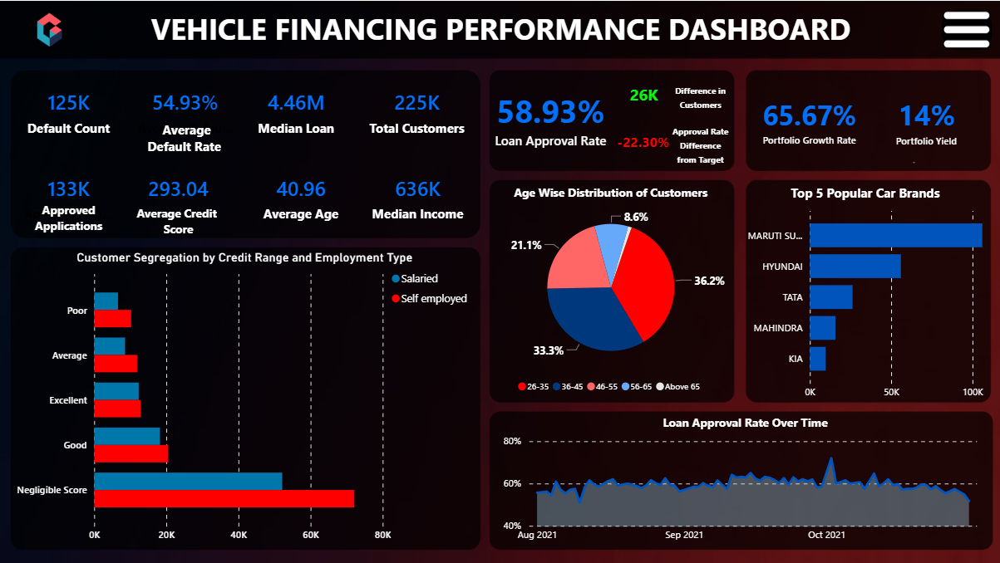
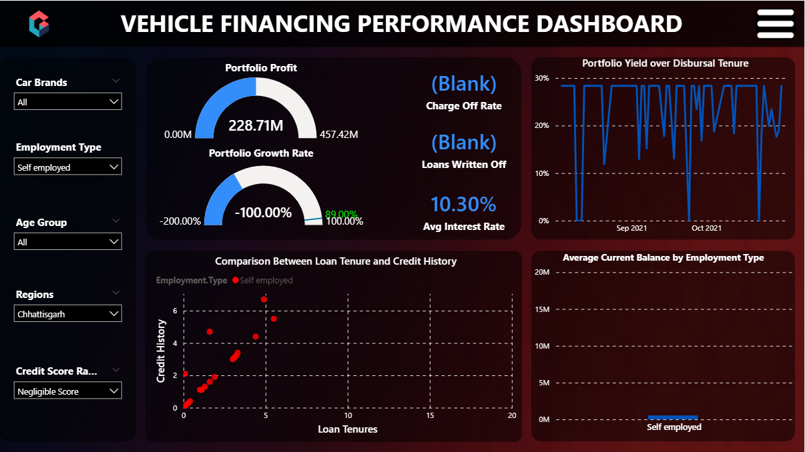
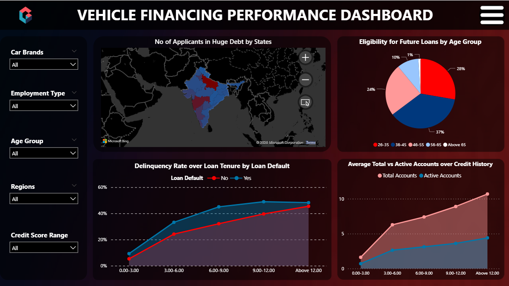
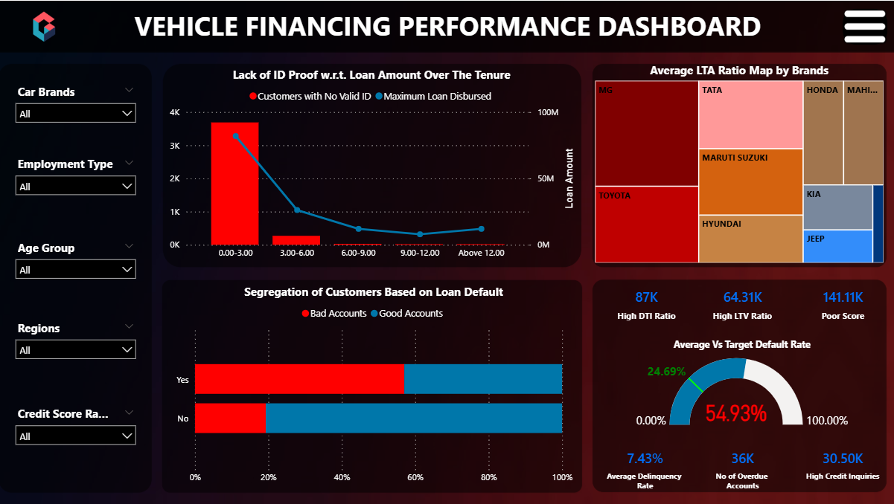

# Data Visualization and BI: Vehicle Financing Performance Dashboard for Automotive Finance

## Overview

This project presents an **interactive business intelligence dashboard** designed to analyze and monitor vehicle financing portfolios in the automotive finance sector. The dashboard integrates financial and customer data to provide insights into **loan approvals, portfolio growth, risk exposure, and customer behavior**, enabling data-driven decision making.

The solution was built using **Power BI for visualization and analytics**, with **Excel used for data cleaning, preprocessing, and transformation**. The dataset contains over **345,000 loan records**, including financial metrics, borrower demographics, and credit information. 

---

## Objectives

* Provide a **unified view of vehicle financing performance**
* Monitor **loan approval trends and portfolio growth**
* Identify **high-risk accounts and delinquency patterns**
* Support **portfolio benchmarking and profitability analysis**

---

## Tech Stack

* **Power BI** – Data visualization and dashboard development
* **Excel** – Data cleaning, preprocessing, and transformation
* **DAX (Data Analysis Expressions)** – Custom measures and financial metrics

---

## Key Features

* Interactive dashboard with filters and drill-down analysis
* Loan approval and portfolio growth monitoring
* Delinquency and default risk analysis
* Customer segmentation and demographic insights
* Performance benchmarking against financial targets

---

## Dashboard Preview

### Overview



### Benchmark Analysis



### KPI and Trends



### Risk Analysis



---

## Key Insights

* Loan approval rates remain **relatively stable across the observed period**. 
* Borrowers aged **36–45 show the highest eligibility for future loans**. 
* Certain regions demonstrate **higher debt concentration**, indicating potential risk areas. 
* Historical defaults strongly correlate with **future delinquency risk**, highlighting the importance of credit history in loan evaluation. 

---

## Repository Structure

```
Vehicle-Financing-Performance-Dashboard
│
├── Capstone.pbix
├── README.md
├── report.pdf
├── screenshots
│   ├── Vehicle dashboard - Intro.png
│   ├── Vehicle dashboard - Benchmark.png
│   ├── Vehicle dashboard - KPI and Trends.png
│   └── Vehicle dashboard - Risk.png
```
